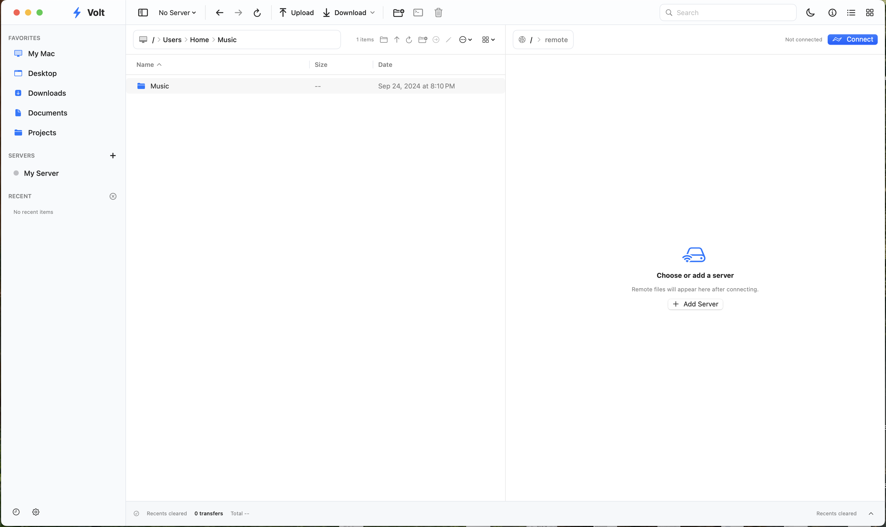

<p align="center">
  
</p>

<h1 align="center">Volt</h1>

<p align="center">
  A native SFTP file manager for macOS, built with SwiftUI and libssh2.
</p>

<p align="center">
  <strong>Dual-pane browsing</strong> &middot; <strong>Secure host-key pinning</strong> &middot; <strong>Transfer queue</strong> &middot; <strong>Remote editing</strong>
</p>

Volt is a focused macOS file-transfer app for working with local and remote
files over SFTP. It provides the familiar dual-pane workflow of a desktop file
manager while keeping credentials out of shell command arguments and project
configuration files.

## Preview

<p align="center">
  <picture>
    <source media="(prefers-color-scheme: dark)" srcset="Support/Screenshots/volt-dark.png">
    <source media="(prefers-color-scheme: light)" srcset="Support/Screenshots/volt-light.png">
    
  </picture>
</p>

<p align="center">
  <sub>Volt adapts cleanly to light and dark macOS appearances.</sub>
</p>

## Contents

- [Preview](#preview)
- [Highlights](#highlights)
- [Requirements](#requirements)
- [Quick Start](#quick-start)
- [Build Options](#build-options)
- [Remote Permissions](#remote-permissions)
- [Security Model](#security-model)
- [Development](#development)
- [Project Layout](#project-layout)
- [Project Status](#project-status)
- [License](#license)

## Highlights

### File Management

- Native SwiftUI interface for macOS.
- Local and remote dual-pane file browser.
- Icon, list, column, and thumbnail-oriented browsing modes.
- Context menus, selection highlighting, sortable metadata columns, and an
  Inspector sidebar.
- Create, rename, move, duplicate, calculate size, and delete files or folders.
- Multiple tabs that preserve connection state, local path, remote path, open
  remote edits, and terminal output.

### Transfers

- Upload and download with a visible, cancellable transfer queue.
- Folder upload and folder download support.
- Parallel transfer tuning for larger download workloads.
- Remote editing with a selectable macOS application, followed by explicit
  upload or discard.
- Configurable permission presets for newly created or uploaded remote items.

### Authentication

- Password authentication.
- SSH private key authentication.
- SSH agent authentication.
- Host-key verification with persistent `known_hosts` pinning.
- Optional SSH terminal panel for key or agent based sessions.

## Requirements

- macOS 15 Sequoia or later.
- Swift 6 with Xcode 16, or matching Command Line Tools.
- Homebrew.
- Native-architecture Homebrew installations of `libssh2` and `openssl@3`.

Install the required libraries:

```bash
brew install libssh2 openssl@3
```

Volt currently builds for the native `arm64` or `x86_64` architecture of the
Mac doing the build. The selected Homebrew libraries must match that
architecture.

## Quick Start

Clone the repository, build a release app bundle, and open it:

```bash
git clone https://github.com/<your-account>/Volt.git
cd Volt
./Scripts/package-app.sh
open build/Volt.app
```

The packaging script automatically:

- Finds Homebrew at `/opt/homebrew` or `/usr/local`.
- Builds Volt for the selected native architecture.
- Bundles `libssh2`, `libssl`, and `libcrypto`.
- Rewrites dynamic library install names for app-bundle loading.
- Applies hardened runtime signing when a Developer ID identity is supplied.
- Produces a ZIP archive suitable for distribution.

Generated artifacts:

```text
build/Volt.app
build/Volt-macOS-<architecture>.zip
```

To run directly through Swift Package Manager:

```bash
VOLT_LIBSSH2_PREFIX="$(brew --prefix libssh2)" swift run Volt
```

## Build Options

Create a DMG in addition to the ZIP archive:

```bash
CREATE_DMG=1 ./Scripts/package-app.sh
```

Build for a specific native architecture:

```bash
ARCH=arm64 ./Scripts/package-app.sh
```

Sign and notarize a distribution build:

```bash
CODE_SIGN_IDENTITY="Developer ID Application: Your Name (TEAMID)" \
NOTARY_PROFILE="volt-notary" \
CREATE_DMG=1 \
./Scripts/package-app.sh
```

Without `CODE_SIGN_IDENTITY`, the script uses an ad-hoc signature.
Notarization requires a Developer ID Application certificate and a configured
`notarytool` Keychain profile.

## Remote Permissions

Each saved connection can select a permission preset used for newly uploaded or
created remote files and folders.

| Preset  | Files  | Folders | Intended use                     |
| ------- | ------ | ------- | -------------------------------- |
| Web     | `0644` | `0755`  | Publicly readable web assets     |
| Private | `0600` | `0700`  | Owner-only files and directories |
| Team    | `0660` | `0770`  | Shared group workflows           |

Volt reports a warning when a transfer or create operation succeeds but the
server refuses the requested permission change.

## Security Model

- SFTP transport and authentication are implemented with libssh2.
- The first connection performs an unauthenticated SSH handshake, displays the
  SHA-256 host-key fingerprint, and requires explicit confirmation.
- Accepted host keys are stored with `0600` permissions. Updates use an
  inter-process lock, a temporary file, `fsync`, and atomic replacement.
- Changed host keys are rejected before authentication.
- Passwords are kept only in the memory of the current tab and are never written
  to Keychain, UserDefaults, connection files, or command arguments.
- Saved connection metadata uses `0600`; application support and temporary edit
  directories use `0700`.
- Connection and host-key probes have a 15-second timeout.
- Downloaded and temporary edit files are created with restrictive permissions.
- Remote directory entries with unsafe or invalid names are skipped before they
  reach the SwiftUI layer.

SSH key or agent authentication is recommended for long-lived server access.

## Development

Run Swift tests:

```bash
swift test
```

Run security-focused C tests for host-key storage and remote entry-name
validation:

```bash
./Scripts/test-security.sh
```

Check whether bundled security dependencies need an update:

```bash
./Scripts/audit-dependencies.sh
```

Release builds include third-party license files and a
`DependencyManifest.json` containing dependency versions, architecture, source
provenance, and SHA-256 hashes of the signed dylibs.

See [`Support/DEPENDENCY_MAINTENANCE.md`](Support/DEPENDENCY_MAINTENANCE.md)
for the release maintenance process.

## Project Layout

```text
Sources/
  CVoltSSH/       C bridge around libssh2 SFTP and host-key operations
  Volt/           SwiftUI app, models, views, transfer queue, terminal panel
  VoltCore/       Shared Swift core utilities
Tests/
  VoltTests/      Swift unit tests
  *.c             Security-focused C tests
Support/          App metadata, entitlements, icons, notices, maintenance docs
Scripts/          Packaging, security tests, and dependency audit helpers
```

## Project Status

Volt currently focuses on SFTP. FTP, FTPS, WebDAV, Amazon S3, folder
synchronization, and background transfers are not implemented.

The SSH terminal panel is available for key or agent based sessions. SFTP
password operations are supported, but password-based interactive SSH terminal
sessions are intentionally not used.

## License

A project license has not been added yet.

Third-party dependency notices are available in
[`Support/THIRD_PARTY_NOTICES.txt`](Support/THIRD_PARTY_NOTICES.txt).
